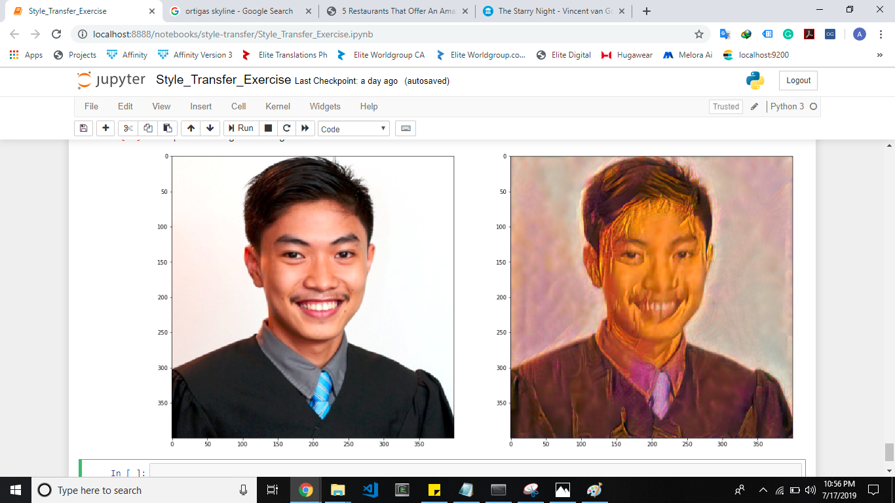
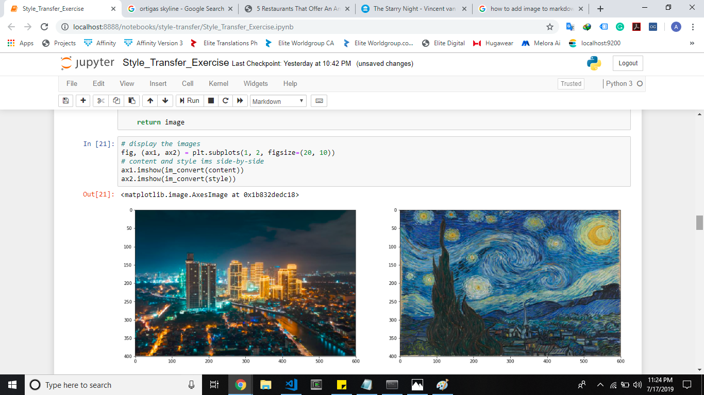
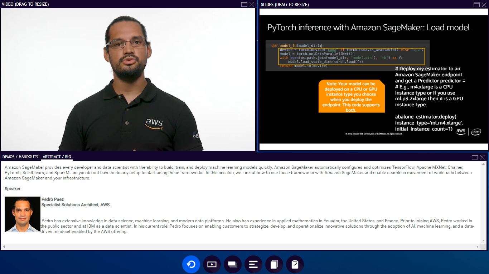
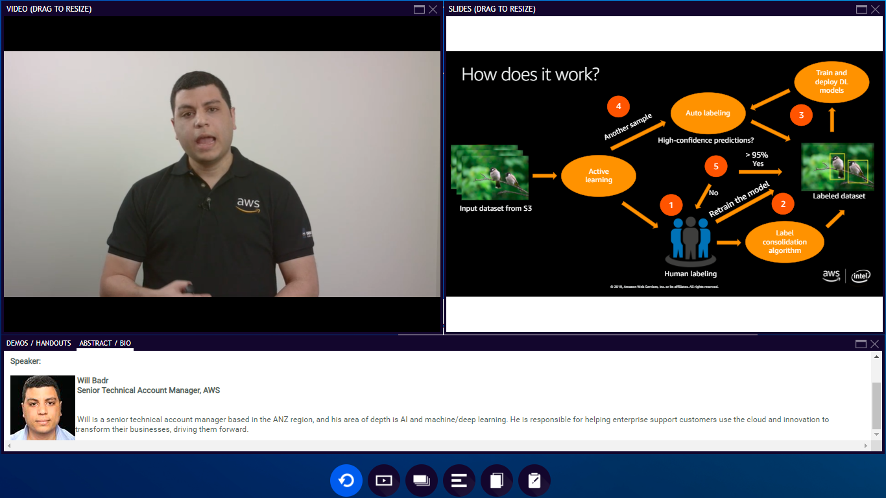
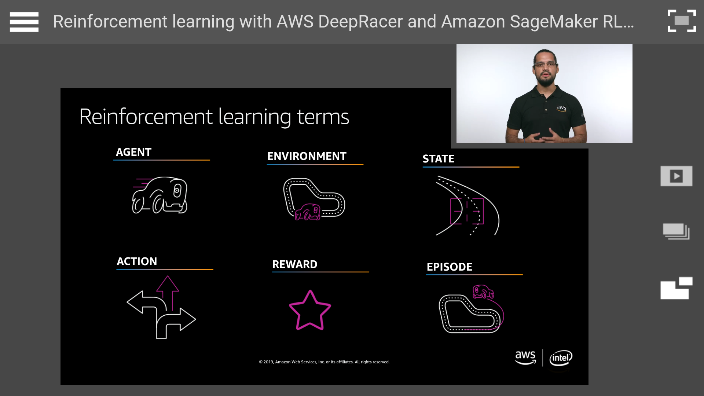
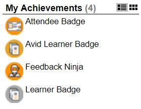

Daily Updates for 60DaysOfUdacity
==========

Day 1:
----------
As part of my foray into data analysis, I recently got my certificate in data analysis from DataCamp
Here is my certificate: https://www.datacamp.com/statement-of-accomplishment/track/7f664142a9a139e49b120194b06ab4a777e25e89

&#35;60DaysofUdacity

Day 2:
----------
Completed the Python Programmer Track from DataCamp. Here is my certificate:
https://www.datacamp.com/statement-of-accomplishment/track/498b6cfe35a643f922395ba2297425bda017c824

&#35;60DaysofUdacity

Day 3:
----------
I reviewed the course Applied AI with Deep Learning from Coursera that touches the following concepts and applications:
1. Deep learning frameworks such as Tensorflow, SystemML, Keras, DeepLearning4J and of course, PyTorch.
2. Learned about Anomaly Detection, Time Series Forecasting, Image Recognition and Natural Language Processing by building up models using Keras on real-life examples from IoT, Financial Marked Data, Literature or Image Databases.
3. Scale deep learning models using Apache Spark and CUDA-enabled GPUs in IBM Cloud Jupyter Notebooks.
You may look at my certificate here: https://www.coursera.org/account/accomplishments/records/XE8F6K6L47L9

&#35;60DaysofUdacity

Day 4:
----------
I recently listened to a podcast by Katharine Jarmul (https://www.datacamp.com/community/podcast/data-security-privacy-gdpr) about the impact of pseudonymization and anonymization in terms of achieving gold standard in data privacy and security.
She tackled portions of the GDPR and how companies are complying to this newly formed regulation.

This is a great deal especially when we tackle Secure and Private AI. As the limits of what AI can do can be daunting, it is a must for the companies who are on the AIs bleeding edge to protect consumers through techniques aforementioned.

A huge takeaway of the day is from the GDPR guidance between anonymization and pseudonymization:
Once data is truly anonymised and individuals are no longer identifiable, the data will not fall within the scope of the GDPR and it becomes easier to use.

&#35;60DaysofUdacity

Day 5:
----------
Since I had some experience working with natural language processing in R particularly the text prediction, I am inclined into learning how it is done in Python.
Milestones for today:
1. Understanding the mathematical intuition behind word2vec where words/tokens are one-hot encoded to create a numpy array suitable for training.
2. Applying word embeddings using numpy to a toy example with 10 sentences using tuples where the key is the token and the value is its neighbor which is applied to all tokens (done using numpy and pandas).
3. Review the intuition behind LSTMs and neural bottlenecks to decrease the dimensionality of vector space for easy learning.

&#35;60DaysofUdacity

Day 6:
----------
Apply document classification using predefined labels applying the word2vec Python module that I learned to use yesterday.
Milestones for today:
1. Use sigmoid activation function on vectors returned by word2vec that is thereby flattened for easy training.
2. Implement binary classification by thresholding > 0.5 for positive sentiment and <0.5 for negative sentiment.
3. Return result as probabilities and classes.
This is not really a good implementation of deep learning especially when I have a handful of segments as well as labels but this really got my hands dirty on things like word embeddings, tokenization, vectorization and padding.

&#35;60DaysofUdacity

Day 7:
----------
1. Utilize CountVectorizer from sklearn.feature_extraction.text to generate tokens of unigrams and bigrams easily that can be fed into the model.
2. Understand the intuition behind interaction terms in document classification where n-grams are not adjacent and still conveys the same thought.
Interaction terms mathematically describe words that are next to each other.

>\beta_1x_1 + \beta _2x_2 + \beta_3(x_1*x_2)

Here, x1 and x2 tells whether tokens appear or not in a row. Beta1 and Beta2 determine token importance. We add another computation of how important these tokens when appeared together via the third term.

I only used scikit-learn for this purpose (ie. PolynomialFeatures and SparseMatrix) but this is enough for me to be familiarized with the intuition behind interaction terms. Hoping for the best in the upcoming projects.

&#35;60DaysofUdacity

PS. I tried LaTeX in formula but obviously, it does not work. Shout out to @Fustincho for giving me the heads up.

Day 8:
----------
Milestones:
1. Review how PyTorch builds tensors, preserve historical computations and handle backpropagation by accumulating gradients using the backward functions.
2. Explore computational graphs specifically autograd functions in PyTorch
Notes:
In deep learning frameworks such as Keras, computational graphs are fixed. Understandable since it has a direct analog to sklearn with respect to pipelines. 
With PyTorch, computational graphs can be updated on the fly without rebuilding the model by implementing autograd.Variable which significantly adds flexibility when racking down tensor changes through functional operations.

&#35;60DaysofUdacity

Day 9:
----------
Milestones:
1. Explored dimensionality reduction techniques on datasets with too many features.
2. Read paper about Akaike Information Criterion, Bayesian Information Criterion and Mallows Cp in determining the best model using step function.
Notes:
I am interested in reducing model complexity by reducing the amount of features to be fed into deep learning model without sacrificing interpretability. In statistics like R squared, it may seem that the model is performing well but the truth is it just accounts for redundant covariates increasing the variance of the variance estimate. 
I don't want to use PCA since that will definitely becomes uninterpretable. With step-wise model building, we can easily determine components that best describe the data by calculating AIC per model iteration. That is, 2*number_of_predictors - 2*ln(sum_of_squared_errors).

A big shoutout to @anne for making an effort in guiding me with my LaTeX conundrum :D. 

&#35;60DaysofUdacity

Day 10:
----------
Finally, I finished the Data Scientist with Python Track on DataCamp.
I finished the last three courses in a day including:
1. Machine Learning with Tree Based Models - provides a new set of intuition for me of CARTs, Random Forests, AdaBoost and Gradient Boosted trees
2. Deep Learning in Python - gave me the best intuition about linear mappings, activation function, gradient descent, and backpropagation.
3. Network Analysis in Python - the most fun course in the whole track which introduced me to a new kind of data structure - graphs in representing networks.

I had so much fun with the specialization. It helped me a lot since I came from an R background. With this, I will be able to continue my learning schedule in Secure and Private AI by reviewing the course from the start.

You can look my certificate here:
https://www.datacamp.com/statement-of-accomplishment/track/e9e4789543d1f100b2714f4fdbcf7eb8d4fa7fa9

&#35;60DaysofUdacity

Day 11:
----------
Before getting up to speed to Secure and Private AI, I decided to brush up my deep learning intuition a little bit by taking Introduction to Deep Learning with PyTorch from Udacity.
I am at the lesson 2 and the course made a perfectly simple explanation of cross-entropy and why we need to compute negative log likelihood every time we use softmax activation function.
I finished 40% of the lesson 2, hoping that I could finish the whole chapter tomorrow.

&#35;60DaysofUdacity

Day 12:
----------
Milestones: 
1. Finish concepts 21 to 35 of Lesson 2 Introduction to Neural Networks.
2. Create my own implementation of gradient descent by implementing activation function, prediction and function that facilitates the update of weights, defined by the learning rate.
3. Delve into the intuitive understanding of backpropagation using sigmoid function.

Learnings:
Backpropagation, to put it simply, calculates the derivative of an error function with respect to each of the weights in the labels by using the chain rule.
As an example, say we have a sigmoid activation function for inputs with one layer before the output. 
If we want to get the derivative of an output of a sigmoid function with respect to 1 input (backpropagating), then we disregard other inputs giving them derivative of zero. 
With that, we can just multiply the weight of that input (which is constant) by the derivative of the sigmoid function with respect to the input itself. Mathematically, we can express this as:

> W_input * d_sigmoid / input

> where d_sigmoid / input = sigmoid(input) * (1 - sigmoid(input))

PS. I hope that I put that explanation simply and a big shoutout to @Erjan for appreciating my answer to his question about PCA.

&#35;60DaysofUdacity

Day 13:
----------
Milestone:
Finished lesson 1 of Introduction to Neural Networks from Intro to Deep Learning Udacity Course.

Learnings:
1. In creating neural networks, we'll err on the side of the complicated model and then we'll apply certain techniques to prevent overfitting. This is different from what I conceived as the right way to build models by starting at the simple solution and going up from there.
2. That L1 can be used for feature selection since that technique creates sparse matrix that turns unimportant predictors into zeros. 
3. That L2 regularization tends to be efficient in model training since it sums of squares conservatively and homogeneously preserve the weights instead of getting zero lambda for suspected predictors with low predictive power.

&#35;60DaysofUdacity

Day 14:
----------
1. Learned a very interesting trick that in Stochastic Gradient Descent, it is better to take a bunch of slightly inaccurate steps in modeling rather than to actually make one good one with all of the data.
2. Watch the interview with Soumith Chintala, the creator of PyTorch about the inspirations behind doing the said framework and the importance of a vibrant and enthusiastic community in order to build one of the best deep learning frameworks to date.

&#35;60DaysofUdacity

Day 15:
----------
I recently acquired a machine with CUDA-enabled specifications and decided to migrate my AI workflow from online notebooks to my local machine. 
1. I installed the necessary packages such as pytorch-1.1.0 and cudatoolkit-9.0. 
2. Started convolutional neural networks from Intro to Deep Learning with PyTorch.

&#35;60daysofudacity 

Day 16:
----------
1. Successfully installed Jupyter Notebook in my local machine. Been testing it now by reviewing Introduction to Pytorch notebooks.
2. Learned scale and rotation invariance as generalization technique for image augmentation in Convolutional Neural Networks. 
3. Watched the explanation David Bau (MIT-IBM Watson AI lab research team member) of how computers show evidence of learning the structure of the physical world. It is a very short clip but this somehow kept me inspired to continue my journey learning neural networks.
> https://www.youtube.com/watch?v=jT5nYLND7co

&#35;60daysofudacity 

Day 17:
----------
As part of my ongoing foray to learn Convolutional Neural Networks from Intro to Deep Learning with PyTorch course, I read some of the online blog posts, outlining the outstanding applications of CNNs in the wild as per the course's curricula. These are:
1. WaveNet, generating human-like voice for text-to-speech systems from DeepMind research - https://deepmind.com/blog/wavenet-generative-model-raw-audio/
2. Novel Approach to Neural Machine Translation from Facebook which resulted in faster modeling speeds using CNN - https://code.fb.com/ml-applications/a-novel-approach-to-neural-machine-translation/
3. Finding Solace in Defeat by Artificial Intelligence, A documentary about the superhuman Go program created by Google DeepMind shows us what it’s like to be superseded by artificial intelligence. - https://www.technologyreview.com/s/604273/finding-solace-in-defeat-by-artificial-intelligence/

Also, I learned the following concepts related to CNN:
1. Pooling Layers - reduces the dimensionality of the convolution layers by striding based on the kernel shape specified, getting either the maximum or the average value in between those strides.
2. Capsule Networks - another configuration of CNNs to detect hierarchically-related features as well as preserve these properties related to these feature relationships such as width, orientation, color, etc.

Finally, from the blogs that I read, this quote stuck on me that I felt the need to share:

> How does it feel to no longer be the best? If mastering Go "requires human intuition", what is it like to have a piece of one’s humanity challenged?

A reflection that we are near to the point where things that we learn best as humans can be learned by computers, even intuition, strategy and logic.

&#35;60DaysofUdacity

Day 18:
----------
Milestones:
1. Trained CIFAR-10 dataset using CNN with three convolutional layers and three pooling layers that uses ReLU as activation function, CrossEntropyLoss for loss function and Stochastic Gradient Descent for optimization.
2. Started with style transfers chapter by Intro to Pytorch Course of Udacity by understanding content image and style image to create a new images of the same content but with features extracted from the style image using Convolutional Neural Networks.

Day 19
----------
Milestones:
1. I started watching the AMA with Robert Wagner a bit late (12:00 AM). So I think I can count it as a milestone for this day.
2. Continued on Style Transfer lesson of Intro to Deep Learning with PyTorch by reading the paper by Gatys on Image Style Transfer Using Convolutional Neural Networks (link: https://www.cv-foundation.org/openaccess/content_cvpr_2016/papers/Gatys_Image_Style_Transfer_CVPR_2016_paper.pdf)
3. Initially ran the exercise notebooks but failed on my first attempt due to missing dependency that needs to be downloaded. Will continue tomorrow.
4. Learned about style and content loss implementations especially the gram matrix that is used to minimize the loss between style image vs target image.

&#35;60DaysofUdacity

Day 20:
----------
Milestones:
1. Successfully setup the dependency VGGNet to run style transfer exercise on my machine.

2. I always want to look like Thanos so I hopped at the chance to use my graduation picture as content and Thanos's face as style to run the style transfer. Clearly, based on the first image, that did not work out well :D.

3. I saved a picture from the Internet of the Manila Skyline at night and Vincent Van Gogh's Starry Night painting. The result really is mesmerizing.

This is a really fun exercise and a great way to realize that Convolutional Neural Networks can do amazing things that are not limited to style transfers. Will definitely explore this field more.

&#35;60DaysofUdacity

Day 21:
----------
Milestones:

Participated in AWS Innovate Online Conference and followed the AI/ML track with the following courses:

1. Build business outcomes with AI and ML

2. Open-source ML frameworks on Amazon SageMaker

3. Accurately automating dataset labeling using Amazon SageMaker Ground Truth

4. Reinforcement Learning with AWS DeepRacer and Amazon SageMaker RL

5. Image and video analysis with Amazon Rekognition and Amazon Textract

Got the attendee badge for participating in 5 required talks in the said conference.

&#35;60DaysofUdacity

Day 22
----------
Milestones:
1. Started recurring neural networks and LSTMs lesson from Intro to Deep Learning with PyTorch.

2. Partially perused several blogs about RNNs and LSTMs (will run through this tomorrow on a long travel). 

Learnings:
1. On the looks of it, Recurrent Neural Networks targets to sequentially learn features from a given dataset by using recursion, getting an input from the previously-trained layer.
2. Unfortunately, RNNs would fail when input features are not related to each other. Since we assume linearity between these inputs, inherent combinations of features that make up an insight and are arbitrarily separated from noise will be forgotten. These are called short term memory.
3. Also, RNNs suffer from vanishing gradients since updating weights using backpropagation is too cumbersome when we have multiple sequential layers.
4. To remedy this, they introduced LSTMs where layers have now the capacity to store important characteristics in long-term memory cell, update recently varied features as well as features characteristics that are unimportant to short-term memory.
5. Information stored to cells as well as the features will pass through different gates to keep important aspects, remove unimportant ones and spit out prediction as output to other LSTM layers.

&#35;60DaysofUdacity

Day 23:
----------
Milestones:
Previously, I studied the general overview of LSTMs and RNN being an extension of it. Today, I continued learning RNNs primarily the gates that make up LSTM on its general working form.
1. Learn Gate takes STM and an event in question by combining them through an activation function tanh and forgets part of it using an ignore factor with a sigmoid activation.
2. Forget Gate basically strips out unimportant information from LTM by multiplying LTM by a forget factor. Forget factor is calculated by using STM and Event Information in a mini neural network with sigmoid as activation function.
3. Remember Gate takes the newly-computed LTM coming out of the forget gate and an STM coming out of the learn gate, combining them together to output a new long term memory.
4. Use gate takes the newly-computed LTM from forget gate and newly-computed STM from the learn gate to come up with a new short term memory as an output. Generally, we just multiply these two outputs.

I understand that even on its general form, LSTMs are quite complicated and researchers on this area are making new schematics that best work on a particular applications. For now, my next steps would be to explore its applications using PyTorch.

&#35;60DaysofUdacity